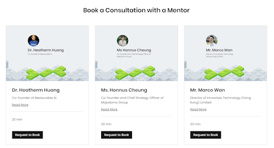

# PolyHack 2023 Website (No Source Code, Demo Only)
PolyHack is a global student-led hackathon and ideathon competition jointly organised by PolyHack, Knowledge Transfer and Entrepreneurship Office (KTEO) at The Hong Kong Polytechnic University (PolyU), and Hong Kong Science and Technology Parks Corporation (HKSTP). The 2-week competition brought together more than 700 talented individuals from over 80 regions, fostering innovation, collaboration, and technological advancements on an international scale.

Learn more about PolyHack 2023 in this [press release](https://www.polyu.edu.hk/en/media/media-releases/2023/0707_global-competition-polyhack-2023-concludes-with-outstanding-innovations-and-collaboration/) and our [hackathon website](https://www.polyhack2023.com/) that me and my team built.

### No Source Code, Demonstration Only

The following will only provide an overview and demonstration of the website - including the software architecture, and a highlight of core features. Because the entire website is property of the PolyHack organising team and the PolyU Knowledge Transfer and Entrepreneurship Office, I cannot share specific technical details and source codes in this repo.

## Overview

I was part of the organising committee serving as a Technical Vice-Lead for the 2023 cohort of the PolyHack event (**I am not a participant**). 

As a Technical Vice-Lead, I led a logistics team of 7 members with a wide range of different backgrounds - from business to design to coding. 

The primary duty of my team is to revamp the entire hackathon website and integrate the registration system, submission system, booking systems, Zoom integration, all under a single website domain, with the **Wix Velo** framework. The goal is to create a concrete fundemental system for our future organising team leaders to improve and sustain in the many years to come. 

We mostly adopted the **agile** project management model, though not strictly. From conception, to branding design, to Figma prototyping, to implementation, and to deployment, the entire development cycle took about 5 months, just in time to launch registrations and align with the start of our marketing campaign.

Other duties of my team include booking and setting up venues for workshops and ceremonies, handling technical support for participants, other team members and judges that uses our system. I personally also had the privilege to design the event rundown and host the [opening](https://www.youtube.com/watch?v=KU7Nhz6kwAk) and [closing ceremony](https://www.youtube.com/watch?v=l_HZsI0objQ) for the event.

My talented logistic team members:

## Website Architecture

### Vision

When I took up this role, me and my team have the following envisions for our website revamp:
- Integrate all forms into a single system on the website: member registration, team formation, work submission into one single system for management. No Google Forms or any other incosistent form input methods.
- Maintain a centralized database with **unique ids** for users, teams to ensure data consistency when managing with group formations, submissions etc...
- Minimize manual work as much as possible and replace it with **automated solutions**, such as generating zoom links for workshops, scheduling mentorship sessions for participants etc...
- Deliver a solution that helps **speed up the judging process for 120+ group submissions**, by creating an judging portal for our staff and our panel of 11 judges to efficiently download the submission materials and grade them on our internal system so our system can calculate scores and generate results automatically.
- Create a visually appealing website with consistent branding design, with a small touch of funny elements, to emphasize the brand of PolyHack and make it appealing to our target audience - high school and university students.
- Create a **concrete technical foundation** for the organizers of PolyHack 2025, 2026, and the many years to come, to sustain their operations and further expand it in the future.

### Framework

The website is built with **Editor X** for the frontend reactive DOM elements and the **Wix Velo** framework for backend scripts. 

Wix Velo is like a customized version of **NodeJS** framework, but with its own library of packages that allows users to integrate with other Wix API services, such as Wix Data for database systems, Events and Booking API for automated Zoom link generation. 

Despite the visual part of the front end is built with the no-code tool Editor X, 80% of the side is custom coded with Javascript in the Wix Velo framework in order to provide functionalities such as disabling certain buttons or generating different texts for different use-cases.

(e.g In the grouping system, the frontend system calls the backend API which queries the database to see if a user has already formed a group. The frontend scripts disables or enables certain texts depending on the user status.)

Our database is maintained by the Wix Data service. Only the back end have the ability to query, add, remove, modify data directly from the database. Each modules in the backend API functions perform input validations to prevent sabotage.

### High-Level Architecture

## Core Features

### Public Pages

#### Misc Information pages
Most of the information pages is still up on our non-members area of the website. Head to the [PolyHack 2023 website](https://www.polyhack2023.com/) and click around!

The home page:

#### Registration System
Particpants who wants to join the competion will have to fill in this sign up form from our home page. To prevent abuse, users have to verify their email.

#### Events RSVP System (Integrated with Wix Events API)

The workshops/ceremonies of PolyHack is open to the public and non-participants are also allowed to register and RSVP to these events. The system is integrated with Wix Events API, which generates Zoom meeting links and email reminders automatically to registered participants.

Head to the [events page](https://www.polyhack2023.com/events-schedule) and take a look!

### Member's Area

The member's area is the core part of our system that deals with participant's grouping, submissions, mentorship sessions booking etc... It is only accessible by registered participants.

#### Member's Home and Navigation Bar
Shows an overview of info that participants should know in the current stage of hackathon.

#### Qualifiers Hub
The qualifier's round is one of the submission stages in this hackathon. In order for participants to be eligible to proceed, they have to attempt 1 of the 7 mind-boggling challenges correctly before a specified deadline. Or else, the system will not allow the user to form a group, and hence not being able to proceed in the next stage of the hackathon.

#### Grouping Hub

The grouping hub allows participants to form a group with other participants based on their user ID. Participants must form a group or else the system will automatically disable the user to access the submission system.

#### Submission Hub

The submission hub lets group leaders to submit their project proposal, business plan, pitch deck, and code to the file server of our system, and also allows group members to review their submission for confirmation. The system automatically disable access if the submission deadline is passed or a user has not formed a group yet.

#### Mentorship Hub (Integrated with Wix Booking API)

This allows participants to book online Zoom consultations with our panel of 3 mentors should they want to seek consultation on their business idea. The system is integrated with Wix Booking API which handles scheduling and generates Zoom meeting link for participants automatically accessible through email or the website.

### Judging Portal
The judging portal is a secret portal only accesible by PolyHack staff and judges. It provides a platform for them to download each group's submission - including code, business plan, pitch deck, and grade the submissions for our system to automatically calculate scores and generate results.

Specific details on the judging procedures cannot be shared in public, but here is a snippet of the judging portal:

## Interesting Statistics During the Entire Event Period (June 8th - 24th)

Total Site Sessions: 

**18,495**

Total Unique Visitors: 

**9,671** 

Number of Backend API Requests:

On the night of the final submission deadline (June 18th),  there are a total of **1,164** backend API requests from 2300 - 0000 as team members are rushing to submit their project before the deadline.

## Final Thoughts

PolyHack 2023 is one of the most stressful, yet astonoushing rewarding projects I have ever done in my development experience. 

I would like to thank my logistic team members for their trust in my leadership. Without their excellence in branding design, website prototyping, project management, and software development, we would not be able to create this spectecular website for our participants to enjoy, and create a concrete technical foundation for PolyHack 2024, 2025, and more years to come to continue expand this legacy. I am very proud of what me and my team have achieved over the span of 5 months.

Allow me to also express my utmost gratitude to PolyHack Founder Scottie Yoon, Lead Jeffrey Kim, External Vice-Lead Romeo Ng and Internal Vice-Lead Sollal Fouilland, for giving me the opportunity, and full autonomy to work on this website with my logistics team. Their support is of crucial value in the success of this.
